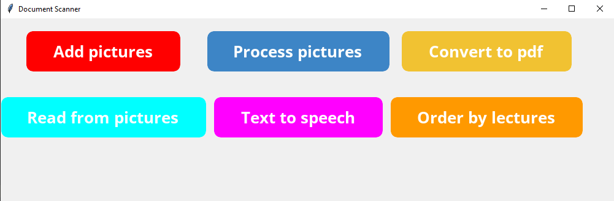

# Document-Scanner

## About
Document Scanner project made for 🚀 To The Moon coding competition.

## Commands
**Add Pictures** - opens folder for pictures to upload

**Process Pictures** - processes pictures, cutting out the papers, makes text more visible and opens folder with processed images

**Convert to Pdf** - processes all images and imports them to pdf format, opens folder with processed pdf files

**Read From Pictures** - read text from pictures and imports it to txt document, opens folder with txt document

**Text to Speech** - reads text from image and convert it to speech

**Order by Lecture** - uses the algorithm that orders images by lectures and export them to folders, opens folder with ordered lectures
